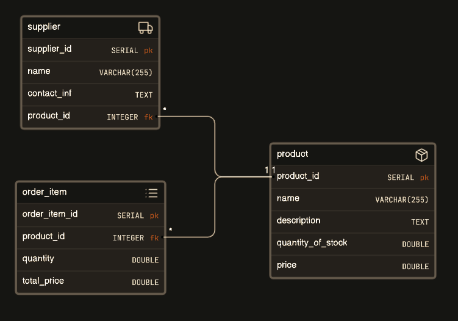

# IMS - Inventory Management System

### Project description:
Develop a desktop application for managing inventory in a retail store or warehouse. 
The system will allow users to track inventory levels, manage product information, handle orders, 
and generate reports.

### Features:
* Product Management: Enable users to add, edit, view, and delete product records. 
Each product record include details such as product name, description, quantity in stock and price.

* Supplier Management: Implement functionality to manage supplier records, including 
adding, editing, viewing, and deleting supplier information. Each supplier record 
include details such as name, contact information, and products supplied.

* Order Management: Provide features for creating, editing, and viewing orders. 
Users are able to add products to orders, specify quantities, and generate
invoices or receipts. The users would see the grand total of their order.
If a user returns a product or buys more, the quantity in stock would update
automatically as well as the total price of the order.

### Database
* Database Structure: Design a relational database with three tables: Product, Supplier, and Order. 
These tables are related to each other through appropriate foreign key relationships. Identification
number (ID) are created automatically in the database and employees would not have to think about adding
new items.

* Database Normalization: Database tables are in the third normal form (3NF) 
to minimize data redundancy and maintain data integrity.

* Database tables relations:

* Postgres SQL:
* I am providing the SQL, because for the Supplier and Orders tables, when I
am deleting a supplier or order, because I have a reference of the product I was 
getting an error, thanks to the "ON DELETE CASCADE" this is no longer a problem.

*  CREATE TABLE products (
  product_id SERIAL PRIMARY KEY,
  name VARCHAR(255),
  description TEXT,
  quantity_of_stock DOUBLE PRECISION,
  price DOUBLE PRECISION
  );

* CREATE TABLE supplier (
  supplier_id SERIAL PRIMARY KEY NOT NULL,
  name VARCHAR(255),
  contact_inf TEXT,
  product_id INTEGER NOT NULL,
  FOREIGN KEY (product_id) REFERENCES products (product_id) ON DELETE CASCADE
  );

* CREATE TABLE orders (
order_id SERIAL PRIMARY KEY,
product_id INTEGER,
FOREIGN KEY (product_id) REFERENCES products (product_id) ON DELETE CASCADE,
quantity DOUBLE PRECISION,
total_price DOUBLE PRECISION
);

